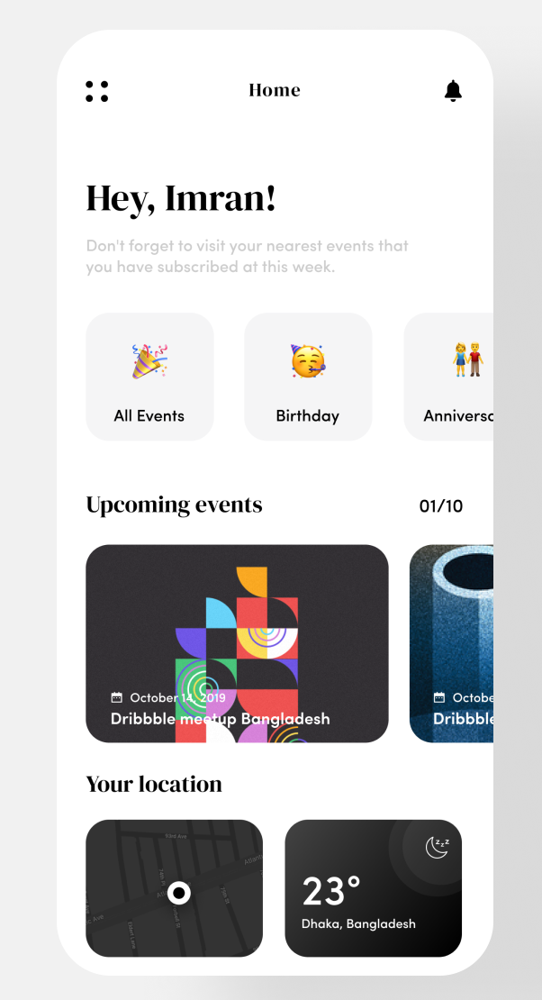
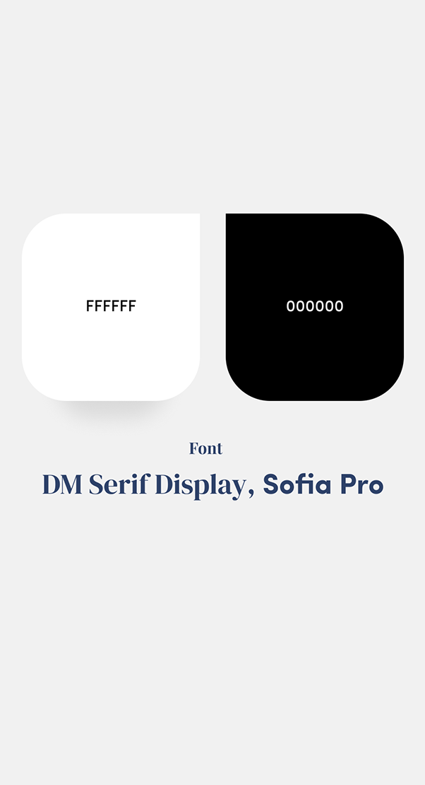
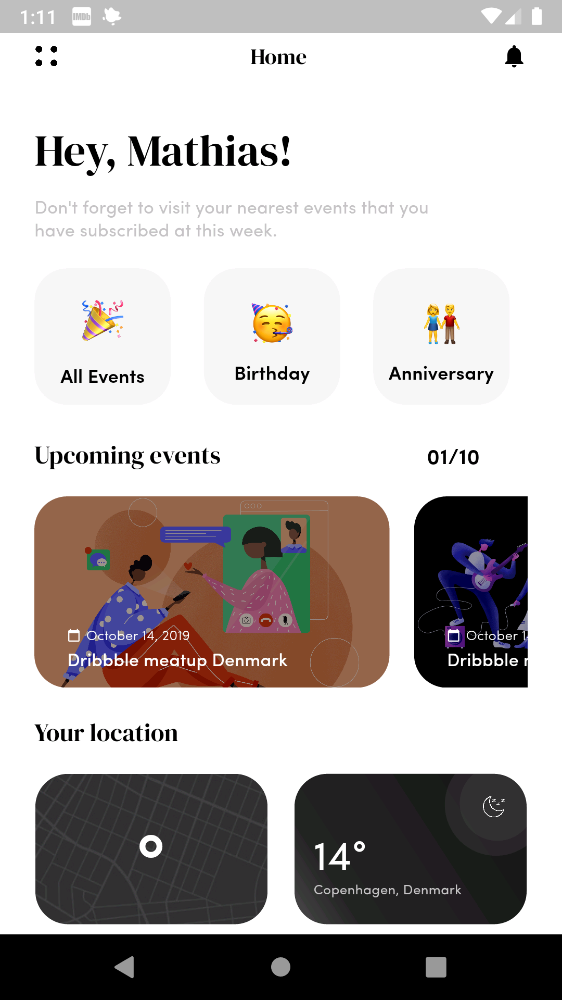

# Event Management App 📅

This is just a minor mobile application built in Flutter with the purpose to re-learn Flutter and all the widgets it provides 🔥.

This repo is the start of understanding app development with Flutter and Dart. This is my weekly goal for **week 44**, and many more are to come, where the Flutter apps becomes more interactive and contentful.

#### Flutter

To install Flutter for your Operation System, Google has a great documentation for exactly that. Click the link below that matches your operating system.

- [Windows](https://flutter.io/setup-windows/)
- [Mac OS](https://flutter.io/setup-macos/)
- [Linux](https://flutter.io/setup-linux/)

I myself use Windows, and with that, I for the moment can only emulate Flutter for Android applications. To emulate for both Android and iOS, you will need a MacBook. For the IDE, I develop my stuff in Visual Studio Code.
- [VSCode](https://flutter.io/get-started/editor/#vscode)

#### The App Itself

The Event Management Application is developed with the following design in mind, where Imran Hossen kindly provided the needed fonts.
https://dribbble.com/shots/7566481-Event-Management-App

The application was developed on a Pixel 2, with API 28. It was not developed to be responsive and therefore most likely will look differently on other devices, and cause overflow. The result is showcased below.

I changed the name to be my own, and the locations to be where I am based. Some of the icons I had to make myself in Adobe Illustrator and Adobe Photoshop. Other icons as well as the art being used will be stated at the bottom of the page with the proper links.

The following is a table for what Flutter widgets I utilised:

| Flutter Widgets in use (listed randomly)  | |
| - | - |
| Scaffold | Stack |
| Column | Row |
| Text | Icon |
| Padding | SizedBox |
| SingleChildScrollView | Container |
| BoxDecoration | Image.asset |
| DecorationImage | BorderRadius |
| Positioned | |

#### Contributions

You are always welcome to contact me for any improvement, contributions and so on. For any issues, just reach out, and I will remove whatver that is causing problems.

- All emojis were downloaded and added locally from the following site
 
[Emojipedia](https://emojipedia.org/)

- The map is a snippet from another map located on Pinterest from etsy
 
[Pinterest](https://www.pinterest.dk/pin/198017714835697594/)

- The two covers used in the "Upcoming events" section are from [Kajsa Ailm](https://dribbble.com/kajsaailm). You can find them here:
 
[Kajsa Ailm - Facetime with babe](https://dribbble.com/shots/6034987-Facetime-with-babe)
 
[Kajsa Ailm - Band members](https://dribbble.com/shots/7824458-Band-members)
